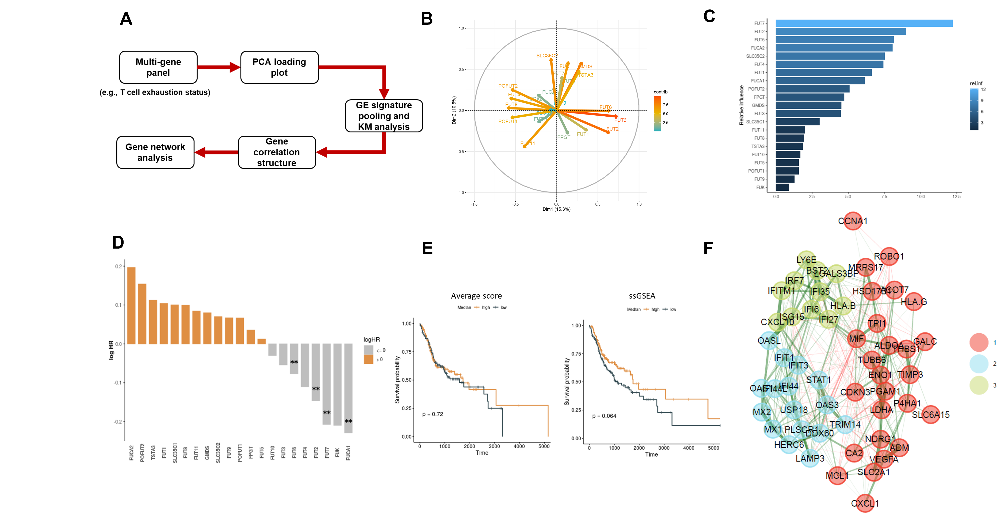

# CGPA 
[CGPA (Cancer Gene Prognosis Atlas)](http://cgpa.moffitt.org/) is an innovative online tool designed to enhance gene-centric biomarker discovery and validation in cancer genomics. CGPA offers comprehensive analysis capabilities, addressing the limitations of existing databases by offering multivariable and multi-gene survival models, crucial for accurate prognostic assessments.
## Overview

  

The CGPA web application is structured around four main modules:

* __Single-Gene Prognostic Discovery__: This module provides a detailed prognostic analysis of individual genes. Traditional methods like univariate regression and Kaplan-Meier plots are commonly used for their simplicity but may introduce biases due to factors such as tumor purity and patient heterogeneity. To combat this, CGPA also includes multivariable analysis to ensure a more comprehensive and robust evaluation of gene prognostic significance.

* __Gene-Pair and Gene-Hallmark Interaction Model__: Recognizing that genes often do not operate in isolation, this module allows for the examination of two genes simultaneously. This approach helps to uncover how gene interactions can influence cellular pathways and responses, providing insights that are more relevant when examining potential synergistic effects.

* __Multi-Gene Panel Discovery__: To address the complexities of gene pathways in cancer genomics, this feature enables the exploration of large groups of genes. By breaking down these groups into smaller, biologically relevant subsets through subnetwork analysis, CGPA allows for a deeper understanding of each gene's role and their interactions within the pathway. This approach helps to identify specific gene subsets associated with particular cancer traits.

* __Immunotherapy Datasets__: The CGPA offers comprehensive gene prognostic exploration in immunotherapy datasets. The app includes all publicly available immunotherapy datasets, allowing users to analyze single genes, gene pairs, and gene sets. This resource is continuously updated to include new datasets and improve the breadth and depth of the available data for research.
## Single-Gene Prognostic Discovery

  
  <figcaption>Overview of main functions in single-gene prognostic discovery</figcaption>

CGPA Single-Gene Prognostic Discovery include a range of key functionalities, including __Pan-cancer Summary__, __Multivariable Analysis__, __Gene-Hallmark Interaction__, __ProgSplicing__, and the __LncRNA Toolbox__.
### Pan-Cancer Summary
* The __Pan-cancer Summary feature__ presents a forest plot for the univariable Cox model, focusing on the inputted gene in relation to Overall Survival (OS) and Progression-Free Interval (PFI).
* The __Gene Expression Profile__ section displays the median expression value of the gene across various cancer types. In this visualization, blue represents normal samples, while orange indicates tumor samples.
* For cancer types where the univariable Cox model in the forest plot shows significance, corresponding __Kaplan-Meier plots__ utilizing the optimal cutoff are displayed in the section titled “Kaplan-Meier Plots (OS optimal cutoff).”
* The __PPI (Protein-Protein Interaction)__ network is derived from STRING, a database known for providing comprehensive protein interaction information.
### Multivariable Analysis
In the "Multivariable Analysis" section, there are two subsections: __Multivariable Analysis__ and __Top Prognostic Genes__.

* Within the __"Multivariable Analysis"__ subsection, users have the option to select either a single cancer type or multiple cancer types for analysis. They can also set different cutoffs for the Kaplan-Meier (KM) plot. 
* Users also have the option to view these results with adjustments for various covariates, including age, sex, CTL, and tumor purity. However, it's important to note that the adjustment for tumor purity is not available for certain cancer types, specifically CHOL, ESCA, MESO, PCPG, SARC, TGCT, THYM, and UVM. Similarly, adjusting for sex is not applicable to CESC, OV, PRAD, TGCT, UCEC, UCS, BASAL-BRCA, and NON-BASAL-BRCA. 
* The __"TOP PROGNOSTIC GENES"__ section presents the top prognostic genes associated with survival outcomes for a specific cancer type, including both protein-coding genes and long non-coding RNAs (lncRNAs). Users can further view a subnetwork generated based on the top prognostic protein-coding genes, offering a more detailed and interconnected view of these genes within the selected cancer type.

### Gene-Hallmark Interaction
We offer a __gene-hallmark Cox interaction model__ to evaluate the interaction between a specific gene and the hallmark in relation to outcomes such as OS and PFI. The hallmarks encompass a range of clinical covariates, including age, sex, and tumor burden, as well as top mutated genes, top Copy Number Alterations (CNA), CYT, AR and a combined score of ISG.RS, Hypoxia and IFN.hallmark. 
* We include two models, GHI full and GHI partial, defined in the following manner:
   - GHI full model: Hazard ~ a x Gene + b x Hallmark + c x Gene X Hallmark
   - GHI partial model: Hazard ~ a x Gene + c x Gene x Hallmark

### ProgSplicing
In cancer research, the same gene can show different prognostic outcomes in various tumor types, such as BTNL9 in lung adenocarcinoma (LUAD) and uterine corpus endometrial carcinoma (UCEC). These opposing results may be explained by __alternative splicing__. To address these discrepancies, we have integrated the __ProgSplicing__ function in CGPA. This feature allows users to check the prognostic direction of genes across different cancer types. 
* Data Sources: Our analysis draws from two comprehensive splicing databases: SpliceSeq and SplAdder (Zhang et al., 2022).
* Visualization: We use different colors to indicate the direction of prognostic results, providing a clear summary of each gene's impact across various cancer types.

### LncRNA Exploration
* In the lncRNA exploration section, we offer additional analysis for lncRNA investigation. Feature: __"TOP PROGNOSTIC GENES ACROSS CANCERS"__, which allows users to explore common genes acorss selected cancer types.
*  Interaction-based multivariable analysis was conducted using the __Tumor Immune Dysfunction and Exclusion (TIDE)__ computational framework (Jiang et al., 2018).
   - The TIDE test involves multivariable Cox-PH regression to assess the interaction between gene expression and tumor CTL levels.
   - The regression model used is Hazard ~ a×CTL + b×lncRNA + c×CTL×V, based on Cox-PH regression.
   - Instead of using five genes (CD8A, CD8B, GZMA, GZMB, PRF1) as in the original TIDE model, this analysis utilizes the CYT score.
*  We provide Heatmap to summarize the overlapped lncRNA genes identified from TIDE-lncRNA analysis, and the KM plot shows the interaction between the gene and CYT.
*  We futher provide __"Coexpression Analysis "__ to identift protein-coding genes that are most closely correlated with the selected lncRNA.

## Gene-Pair Dsicovery
CGPA for Gene-Pair Discovery is primarily designed for conducting survival analysis when you have two gene inputs. It provides a comprehensive set of tools for analyzing the survival data associated with these genes.

* __Univariable Model__: Users can perform univariable analysis for each of the two genes. This includes: Kaplan-Meier (KM) plots to visualize survival curves for individual genes, and the Univariable Cox proportional hazards (coxph) models to quantify the effect of each gene on survival.
* __Two Gene Model__: In this section, users can classify gene expression levels as high or low and examine Kaplan-Meier (KM) plots for different combinations, such as low+low, low+high, high+low, and high+high. The tool also provides overall and pairwise log-rank tests, as well as multivariable Cox proportional hazards (coxph) models that simultaneously consider both genes.
* __Interaction Model__: Users can investigate the interactions between the two genes using a multivariable Cox model that includes interaction terms and visualize these interactions through Kaplan-Meier (KM) plots.
* __Gene Ratio Model__: Enable users to investigate the relationship between the two genes by calculating their ratio, analyze survival data using Kaplan-Meier (KM) plots based on gene ratios, and perform univariable Cox proportional hazards (coxph) modeling with gene ratios to understand their impact on surviva
* __Correlation__: The tool provides the Pearson and Spearman correlation between the two inputed genes.

## Multi-Gene Panel Discovery

  
  <figcaption>Overview of main functions in multi-gene prognostic discovery</figcaption>

CGPA PLUS is designed for the analysis of gene groups. Currently, CGPA includes features like Tcell stat, Hypoxia, IFN.hallmark, ISG.RS, among others. Additionally, users have the flexibility to input their own gene lists. This can be done by selecting the "customize your own gene" option and then either entering the desired genes in the search box or uploading a gene list in CSV format, where each row contains a gene name.

### Prognotics Ranking
* The __"Prognostic Ranking"__  includes a gradient boosting importance score. This score is derived from applying gradient boosting to the group of genes, ranking the genes based on their influence. The most influential gene appears at the top of the list.
* Additionally, this feature presents a waterfall plot that illustrates the univariable Cox regression results for the gene group.

### Joint Signature
The __"Joint Signature"__  offers a Kaplan-Meier plot for a geneset based on either the average score or the overall gene set enrichment score (determined by ssGSEA). Additionally, users have the flexibility to select their preferred KM cutoff for this analysis.

### Subnetwork
The "SUBNETWORK" tab utilizes "EGAnet" to dissect the gene group, with the results for each module displayed in the "forest plot for each module." When selecting "HNSC", users have the option to include or exclude anchor genes such as PTPRC, DCN, and KRT14. These anchor genes are known for their association with immune, stromal, and malignant communities.

### Multi-gene Correlation
The "MULTI-GENE CORRELATION" feature includes a correlation network, PCA loading plot, and Spearman correlogram. These tools collectively display the pairwise correlations between genes.

### Custom Portal
For the "Custom Portal", users have the flexibility to upload their own datasets for genesets exploration.

## Immunotherapy Discovery
The CGPA provides a platform for gene prognostic exploration in immunotherapy datasets. It includes all publicly available datasets, enabling users to investigate single genes, gene pairs, and gene sets. The app supports detailed survival analysis and is continually updated to incorporate new data, ensuring comprehensive resources for researchers in the field of immunotherapy.
