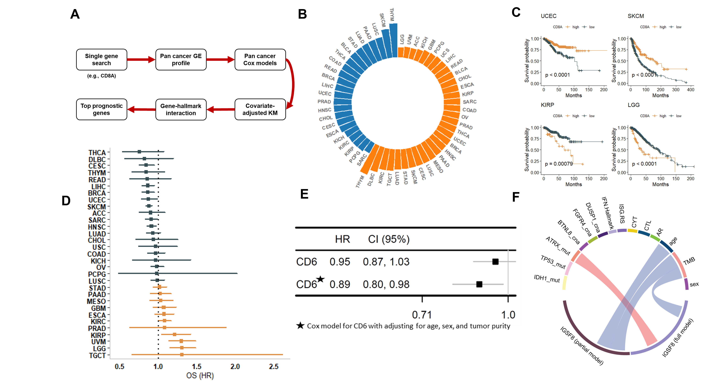
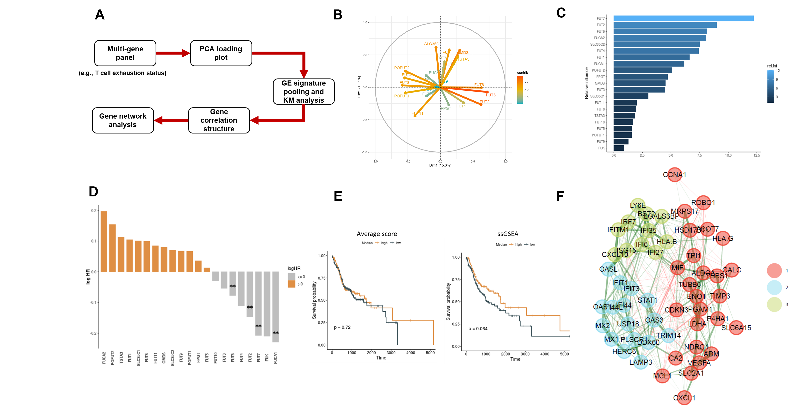

# CGPA 
CGPA (Cancer Gene Prognosis Atlas) is an innovative online tool designed to enhance gene-centric biomarker discovery and validation in cancer genomics. CGPA offers comprehensive analysis capabilities, addressing the limitations of existing databases by offering multivariable and multi-gene survival models, crucial for accurate prognostic assessments. 
## Overview

  

The CGPA web application is structured around three main modules:

* __Single-Gene Prognostic Discovery__: This module provides a detailed prognostic analysis of individual genes. Traditional methods like univariate regression and Kaplan-Meier plots are commonly used for their simplicity but may introduce biases due to factors such as tumor purity and patient heterogeneity. To combat this, CGPA also includes multivariable analysis to ensure a more comprehensive and robust evaluation of gene prognostic significance.

* __Gene-Pair and Gene-Hallmark Interaction Model__: Recognizing that genes often do not operate in isolation, this module allows for the examination of two genes simultaneously. This approach helps to uncover how gene interactions can influence cellular pathways and responses, providing insights that are more relevant when examining potential synergistic effects.

* __Multi-Gene Panel Discovery__: To address the complexities of gene pathways in cancer genomics, this feature enables the exploration of large groups of genes. By breaking down these groups into smaller, biologically relevant subsets through subnetwork analysis, CGPA allows for a deeper understanding of each gene's role and their interactions within the pathway. This approach helps to identify specific gene subsets associated with particular cancer traits.
## Single-Gene Prognostic Discovery

  

## Gene-Pair and Gene-Hallmark Interaction Model
## Multi-Gene Panel Discovery

  

## Immunotherapy Discovery

